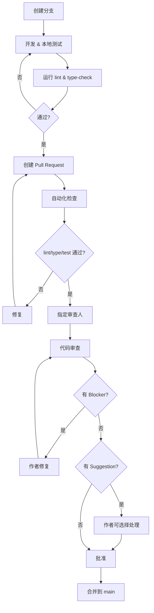

# MIDI-JAR 代码审查标准与流程

> 版本：v1.0  
> 适用项目：MIDI-JAR（Vue 3 + TypeScript + Tauri）  
> 目标：让每一次代码审查都能提升代码质量，培养团队工程素养

---

## 目录

1. [核心原则](#1-核心原则)
2. [审查流程](#2-审查流程)
3. [分级标准](#3-分级标准)
4. [Checklist](#4-checklist)
5. [Review 模板](#5-review-模板)
6. [PR 模板](#6-pr-模板)
7. [提交规范](#7-提交规范)
8. [工具配置](#8-工具配置)
9. [常见误区](#9-常见误区)
10. [附录](#10-附录)

---

## 1. 核心原则

### 1.1 审查理念

| 原则 | 说明 |
|------|------|
| **🧑‍🏫 审查即教学** | 每条评论都应该帮助作者成长，不只是挑错 |
| **🎯 关注本质** | 正确性 > 安全性 > 可维护性 > 性能 > 风格 |
| **💬 建议而非命令** | "考虑用 X 因为 Y" 优于 "改成 X" |
| **👍 也要点赞** | 好的设计、清晰的命名、优雅的解法都值得表扬 |
| **⏱ 及时响应** | PR 创建后 24h 内完成首轮审查 |

### 1.2 谁可以审查

- **任何团队成员**都可以对任何 PR 提出评论
- **正式批准（Approval）**需要至少 1 名资深开发者
- 作者**不能批准自己的 PR**
- 紧急修复（hotfix）可放宽至 1 人批准，但事后需补审

### 1.3 什么需要审查

所有对 `main` / `master` 分支的合并请求都需要审查，包括：

- 新功能（Feature）
- Bug 修复
- 重构
- 配置变更
- 文档更新（超过 20 行）
- 依赖更新

---

## 2. 审查流程



### 2.1 详细步骤

#### Step 1: 开发自测（作者）

```bash
# 提交前必须通过
npm run type-check      # TypeScript 类型检查
npm run lint            # ESLint
npm run test -- run     # 单元测试
npm run build           # 构建验证
```

#### Step 2: 创建 PR

- 使用 [PR 模板](#61-pr-模板) 填写描述
- 确保 PR 标题符合 [Conventional Commits](#7-提交规范)
- 将 PR 标记为 **Draft** 直到准备就绪

#### Step 3: 自动化检查

通过 GitHub Actions 或 CI 自动执行：

- ✅ ESLint + Prettier
- ✅ TypeScript 类型检查 (`vue-tsc --noEmit`)
- ✅ 单元测试 (`vitest run`)
- ✅ 构建 (`vite build`)

所有检查通过后，PR 标记为 **Ready for Review**。

#### Step 4: 分配审查人

- 小 PR（< 200 行变更）：1 人审查即可
- 大 PR（> 500 行变更）：至少 2 人审查
- 涉及核心模块（MIDI 处理、音频引擎）：必须有相关领域经验的审查人

#### Step 5: 审查

使用 [Checklist](#4-checklist) 逐项检查，按 [分级标准](#3-分级标准) 标注问题。

#### Step 6: 修复与迭代

- **Blocker** 必须修复，修复后请求重新审查
- **Suggestion** 可不修复，但需要回复理由
- **Nit** 可直接 resolve 或批量处理

#### Step 7: 合并

- Squash merge（推荐）或 Merge commit
- 合并后删除源分支

---

## 3. 分级标准

每条审查评论必须带有优先级标记。

### 🔴 Blocker（必须修复）

| 类别 | 示例 |
|------|------|
| **安全漏洞** | XSS、注入、敏感信息泄露、不安全的 `innerHTML` |
| **数据丢失风险** | 未确认的删除操作、覆盖文件而未备份 |
| **逻辑错误** | 条件判断相反、边界条件遗漏、竞态条件 |
| **API 破坏** | 修改了公共接口签名未通知使用者 |
| **资源泄漏** | 未取消的事件监听、未清理的定时器/观察者 |
| **并发问题** | 共享状态未加锁、异步操作的时序依赖 |

**处理**：作者必须修复，然后重新请求审查。

### 🟡 Suggestion（建议修复）

| 类别 | 示例 |
|------|------|
| **缺少输入验证** | 未校验 MIDI 值范围（0-127）、空数组未处理 |
| **可读性问题** | 复杂的嵌套条件、魔法数字、模糊的命名 |
| **代码重复** | 相似逻辑出现在多处，可提取为工具函数 |
| **测试缺失** | 新增逻辑缺少对应的单元测试 |
| **性能隐忧** | 不必要的数组复制、高频触发的重计算、DOM 操作 |
| **类型安全** | 过多的 `as` 断言、未使用的 `any`、非空断言 `!` |
| **错误处理** | catch 块为空、Promise 未处理 rejection |

**处理**：建议修复，作者可选择是否修复；不修复需说明理由。

### 💭 Nit（锦上添花）

| 类别 | 示例 |
|------|------|
| **命名微调** | `getData` → `getMidiDataByNote` |
| **注释补充** | 复杂算法缺少一句话说明 |
| **日志改进** | 错误信息不够具体 |
| **代码组织** | 导入顺序、空行使用 |
| **替代方案** | 可以参考的其他实现方式 |

**处理**：可忽略或批量修复，无需重新审查。

---

## 4. Checklist

### 4.1 通用检查项

#### 🔴 必须检查

- [ ] 是否存在 XSS / 注入风险？（`v-html`、`innerHTML`、用户输入拼接）
- [ ] 是否存在竞态条件？（异步操作未正确处理时序）
- [ ] 资源是否被正确释放？（`onUnmounted` / `onBeforeUnmount` 中清理）
- [ ] 类型是否正确？（避免滥用 `any` 和 `as` 断言）
- [ ] 错误路径是否被处理？（网络请求、文件操作、MIDI 设备断连）
- [ ] 是否有死代码或 console.log 遗留？

#### 🟡 应该检查

- [ ] 命名是否清晰地表达了意图？
- [ ] 函数/组件是否职责单一？
- [ ] 是否有不必要的代码重复？
- [ ] 核心逻辑是否有单元测试覆盖？
- [ ] 边界条件是否被处理？（空数组、null、0、负值）
- [ ] 性能是否有明显瓶颈？（不必要的响应式计算、大数组遍历）
- [ ] 是否存在魔法数字？（应该提取为常量）

#### 💭 可以检查

- [ ] 注释是否与代码一致？（需不需要更新？）
- [ ] 是否有更优雅的写法？（可选链 `?.`、空值合并 `??`、解构赋值）
- [ ] 文件命名是否与团队惯例一致？

### 4.2 Vue 组件专项

#### 🔴 必须检查

- [ ] 模板中是否使用了 `v-html`？（考虑 XSS 风险）
- [ ] `key` 属性是否正确用于 `v-for` 列表？
- [ ] props 是否有合理的默认值（`withDefaults`）？
- [ ] emit 的事件是否有明确的类型声明？

#### 🟡 应该检查

- [ ] 组件是否过于庞大？（考虑拆分为子组件）
- [ ] computed 是否有副作用？（computed 应该是纯函数）
- [ ] watch 的 `immediate` 和 `deep` 使用是否合理？
- [ ] 模板逻辑是否过于复杂？（应该提取到 script 中）
- [ ] 样式是否使用 scoped 或 CSS Modules？

#### 💭 可以检查

- [ ] 模板和 script 的顺序是否一致？（建议：template → script → style）
- [ ] 是否利用了 `<script setup>` 的语法糖简化代码？
- [ ] teleport、Suspense、KeepAlive 等内置组件使用是否合理？

### 4.3 TypeScript 专项

#### 🔴 必须检查

- [ ] 是否存在显式 `any` 类型？（如非必要应使用 `unknown` + 类型守卫）
- [ ] 是否存在非空断言 `!`？（如 `obj!.prop`，考虑是否有更安全的写法）
- [ ] 类型断言 `as` 是否安全？（避免 `as any` 链条）
- [ ] 异步函数返回值是否被正确 await？

#### 🟡 应该检查

- [ ] 是否充分利用了 TypeScript 的联合类型/交叉类型？
- [ ] 泛型约束是否合理？（`extends` 是否必要）
- [ ] 接口/类型定义是否放在正确的位置？（全局类型 vs 模块内部）
- [ ] 是否导出了内部不应该暴露的类型？

### 4.4 Pinia Store 专项

- [ ] Store 是否职责单一？（一个 store 只管理一个领域）
- [ ] 异步操作（`getManager`、`subscribeToNamespace`）是否有错误处理？
- [ ] 引用计数管理是否正确？（`subscribe`/`unsubscribe` 对称性）
- [ ] `$reset` 是否正确地清理了所有状态和资源？

### 4.5 MIDI / 音频专项

- [ ] MIDI 消息字节是否在有效范围内？（Status: 0x80-0xFF, Data: 0x00-0x7F）
- [ ] 音频相关资源是否在组件卸载时正确释放？
- [ ] VexFlow/Pixi.js 渲染器的生命周期是否正确管理？
- [ ] 大量 MIDI 消息传入时是否有性能保护？（节流、缓冲、对象池）

### 4.6 测试专项

- [ ] 新增逻辑是否有对应的单元测试？
- [ ] 测试是否覆盖了正常路径、异常路径和边界条件？
- [ ] 测试命名是否清晰？（`should...when...` 格式或中文描述）
- [ ] 测试是否避免了测试实现细节？
- [ ] Mock/stub 是否合理？（不过度 mock）
- [ ] 快照测试是否有意义？（避免无用快照）

---

## 5. Review 模板

### 5.1 PR 审查评论模板

```markdown
🔴 **Blocker: [问题类别]**
行号：XX-XX

**问题描述：**
（用一两句话说明问题是什么）

**为什么这是个问题：**
（解释潜在的后果或风险）

**建议方案：**
（提供具体的修改建议，或参考代码）

---

🟡 **Suggestion: [建议类别]**
行号：XX

**建议：**
（建议修改的内容）

**理由：**
（为什么这样更好）

---

💭 **Nit:**
行号：XX

（可选的小改进）
```

### 5.2 审查总结模板

```markdown
## 审查总结

**文件范围：** [涉及的文件列表]
**审查耗时：** [时间]

### 整体评价
✅ / ⚠️ / 🔴

（总体印象：哪些做得好，主要的关注点）

### Blockers（需修复）
- [ ] [#1] [简短描述]（行号）

### Suggestions（建议修复）
- [ ] [#2] [简短描述]（行号）

### Nits（可选）
- [#3] [简短描述]（行号）

### 值得表扬
- [做得好的地方]
- [值得学习的模式]

---

> 所有 Blocker 修复后请 @reviewer 重新审查。
```

---

## 6. PR 模板

### 6.1 Pull Request 描述模板

在项目根目录创建 `.github/PULL_REQUEST_TEMPLATE.md`：

```markdown
## 描述

请简要描述此 PR 的内容和目的。

关联 Issue：#[issue_number]

## 变更类型

- [ ] ✨ 新功能
- [ ] 🐛 Bug 修复
- [ ] ♻️ 重构
- [ ] 📝 文档
- [ ] 🔧 配置/构建
- [ ] ⬆️ 依赖更新
- [ ] 🚨 紧急修复

## 自测清单

- [ ] 代码通过了 `npm run type-check`
- [ ] 代码通过了 `npm run lint`
- [ ] 新增/修改的代码有单元测试覆盖
- [ ] 所有测试通过：`npm run test -- run`
- [ ] 构建成功：`npm run build`

## 测试说明

（如何验证此变更的正确性？手动测试步骤或自动化测试覆盖范围）

## 截图（UI 变更时必填）

（如果有 UI 变更，请提供前后对比截图）

## 注意事项

（部署注意事项、回滚方案、对其他模块的影响等）
```

---

## 7. 提交规范

### 7.1 Commit Message

遵循 [Conventional Commits](https://www.conventionalcommits.org/) 规范：

```
<type>(<scope>): <description>

[optional body]

[optional footer]
```

**Types：**

| Type | 含义 |
|------|------|
| `feat` | 新功能 |
| `fix` | Bug 修复 |
| `refactor` | 重构（不涉及功能变更） |
| `perf` | 性能优化 |
| `test` | 增加/修改测试 |
| `docs` | 文档 |
| `style` | 代码风格（格式化等） |
| `chore` | 构建/配置/工具 |
| `types` | 类型定义变更 |

**示例：**

```
feat(piano): add sustain pedal visual feedback

fix(midi): handle Note Off messages with velocity 0

refactor(notation): extract staff rendering into separate module

test(chord-detect): add inversion detection tests
```

### 7.2 分支命名

```
<type>/<short-description>

示例：
feat/sustain-pedal-display
fix/midi-channel-off-by-one
refactor/extract-renderer-utils
test/add-chord-detection-tests
```

---

## 8. 工具配置

### 8.1 已配置的工具

本项目已配置了以下代码质量工具：

| 工具 | 用途 | 配置状态 |
|------|------|----------|
| ESLint + Prettier | 代码风格与质量 | ✅ 已配置（`eslint.config.js` + `.prettierrc`） |
| TypeScript Strict | 类型安全 | ✅ 已启用（`strict: true`） |
| vue-tsc | Vue 类型检查 | ✅ 构建时执行 |
| Vitest | 单元测试 | ✅ 可使用（`npm run test`） |
| lint-staged | 暂存区检查 | ✅ 已配置 |

### 8.2 建议补充的工具

#### 🔧 git hooks（Husky）

在项目根目录执行：

```bash
# 安装 Husky
npm install --save-dev husky
npx husky init

# 添加 pre-commit hook: 在提交前运行 lint-staged
echo "npx lint-staged" > .husky/pre-commit

# 添加 pre-push hook: 在推送前运行类型检查和测试
echo "npm run type-check && npm run test -- run" > .husky/pre-push
```

#### 🔧 GitHub Actions CI

创建 `.github/workflows/ci.yml`：

```yaml
name: CI

on:
  pull_request:
    branches: [main]

jobs:
  quality:
    runs-on: ubuntu-latest
    steps:
      - uses: actions/checkout@v4
      - uses: actions/setup-node@v4
        with:
          node-version: 22
      - run: npm ci
      - run: npm run lint
      - run: npm run type-check
      - run: npm run test -- run
      - run: npm run build
```

### 8.3 当前 ESLint 配置的改进建议

当前 `eslint.config.js` 中 `@typescript-eslint/no-explicit-any` 被设为 `off`。建议改为 `warn` 逐步收紧：

```javascript
"@typescript-eslint/no-explicit-any": "warn",
```

逐步替换现有的 `any` 类型为更精确的类型或 `unknown`。

---

## 9. 常见误区

### 审查方

| ❌ 误区 | ✅ 正确做法 |
|---------|------------|
| 只挑毛病 | 同时指出哪里写得好 |
| 要求完美 | 允许未来改进，关注当下 |
| 指定具体实现 | 描述问题，让作者选择方案 |
| 审查太久 | 小 PR 30min 内，大 PR 2h 内 |
| 风格争论 | 交给 Prettier + ESLint 自动处理 |
| 审查太多文件 | 一次 PR 不超过 500 行变更 |

### 提交方

| ❌ 误区 | ✅ 正确做法 |
|---------|------------|
| 超大 PR（> 1000 行） | 拆分为多个小 PR |
| 混合无关变更 | 一个 PR 一个主题 |
| 不写 PR 描述 | 写清楚做什么、为什么、如何验证 |
| 没有测试 | 新增逻辑附上测试 |
| 不回复评论 | 每条评论至少点个 ✅ 表示已读 |
| 通过后还追加变更 | 新变更开新 PR |

---

## 10. 附录

### 10.1 项目技术栈速查

| 领域 | 技术 |
|------|------|
| 框架 | Vue 3.5 + Composition API / `<script setup>` |
| 语言 | TypeScript 6.x |
| 构建 | Vite |
| 状态管理 | Pinia 3.x |
| 路由 | Vue Router 5.x |
| 样式 | Tailwind CSS 4.x + DaisyUI 5.x |
| 测试 | Vitest + @vue/test-utils |
| 桌面 | Tauri 2.x |
| MIDI | Tone.js 15.x + @tonejs/midi |
| 乐谱 | VexFlow 5.x |
| 渲染 | Pixi.js 8.x |
| 节点编辑器 | Vue Flow 1.x |

### 10.2 常用命令

```bash
# 类型检查
npm run type-check

# Lint 检查
npm run lint

# 自动修复格式
npm run format:fix

# 运行测试
npm run test
npm run test:watch        # 监听模式
npm run test:coverage     # 覆盖率

# 完整构建
npm run build:pre         # format + type-check + build
```

### 10.3 参考资源

- [Vue 3 风格指南](https://vuejs.org/style-guide/)
- [TypeScript 编码规范](https://google.github.io/styleguide/tsguide.html)
- [Conventional Commits](https://www.conventionalcommits.org/)
- [Vue Test Utils 指南](https://test-utils.vuejs.org/guide/)

---

> **版本历史**
>
> | 日期 | 版本 | 变更说明 |
> |------|------|----------|
> | 2026-07-06 | v1.0 | 初版制定 |
